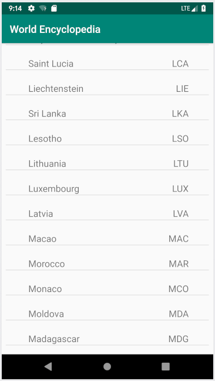
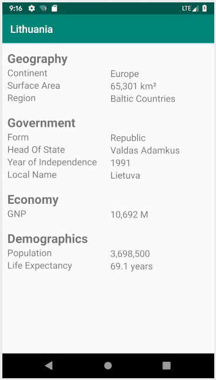

# World Encyclopedia

A kotlin android app for viewing country information. Built on top of the world database avaliable [here](https://dev.mysql.com/doc/world-setup/en/).

## GUI

## Built With

* [Kotlin](https://kotlinlang.org/)
* [Android Studio](https://developer.android.com/studio)

## Authors

* **Andrew Moss** - *Creator* - [agmoss](https://github.com/agmoss)

## License

This project is licensed under the MIT License - see the [LICENSE.md](LICENSE.md) file for details